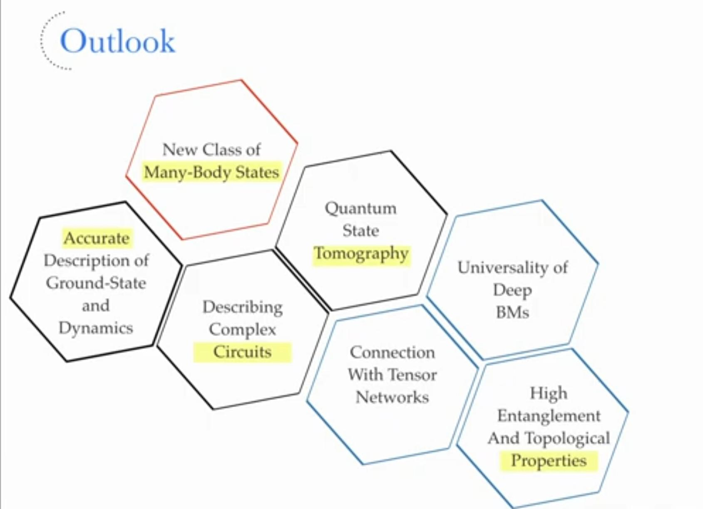
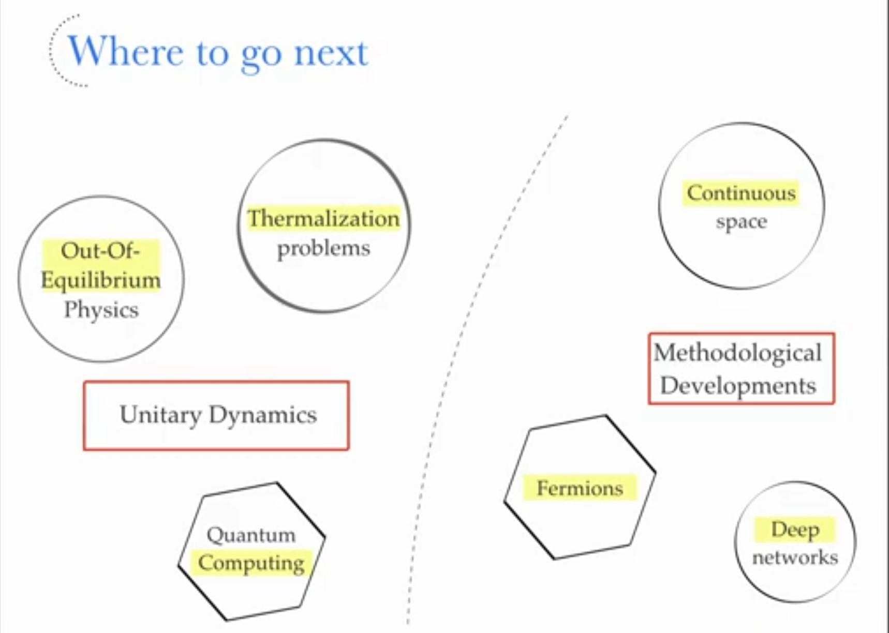

## Solving the Quantum Many-Body Problem with Artificial Neural Networks by Giuseppe Carleo

### 文章总结

### 一些思考
能否用NQS解决符号问题？
文章使用RBM，能否用更好的模型？

### 作者的Presentation&提及的Outlook

## NQS的最新的综述，[From Architectures to Applications: A Review of Neural Quantum States](https://iopscience.iop.org/article/10.1088/2058-9565/ad7168/meta)(20 August 2024)
